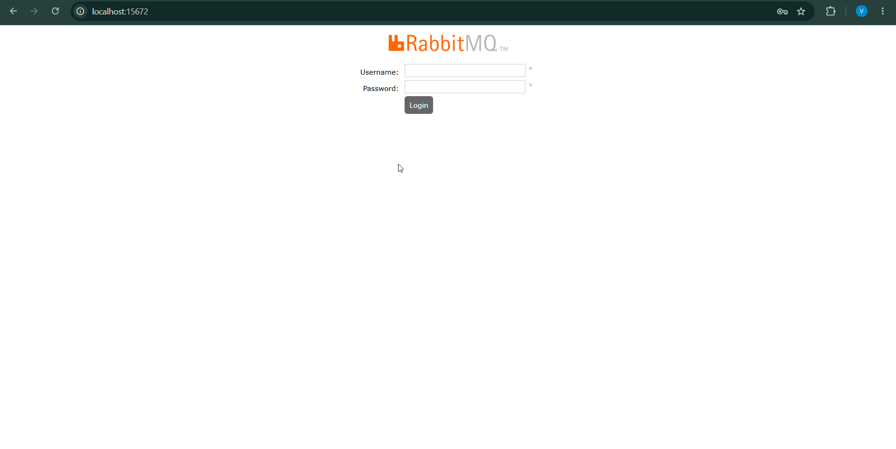
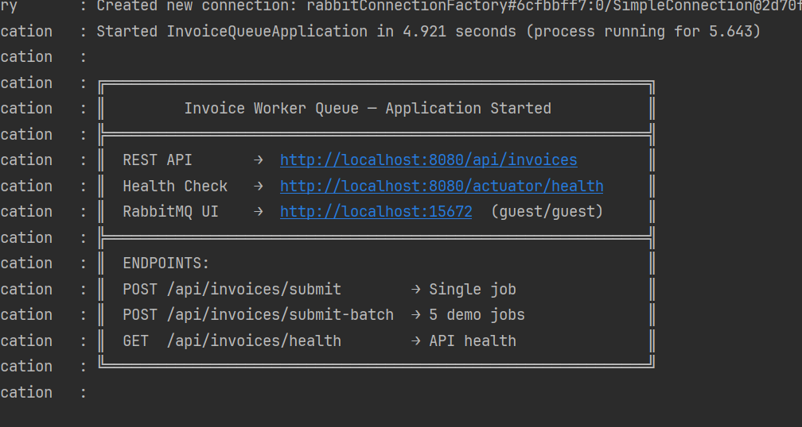
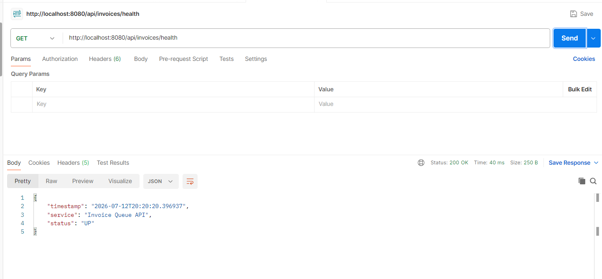
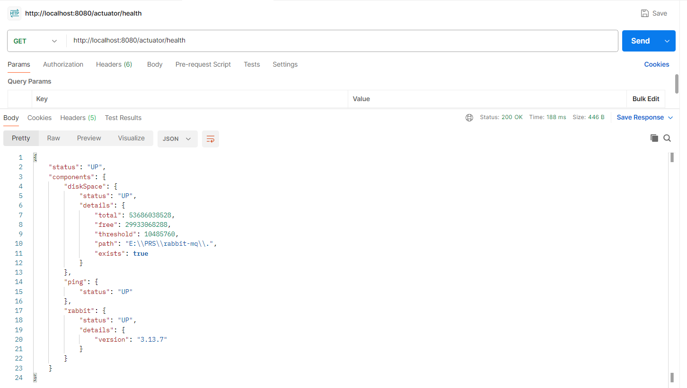
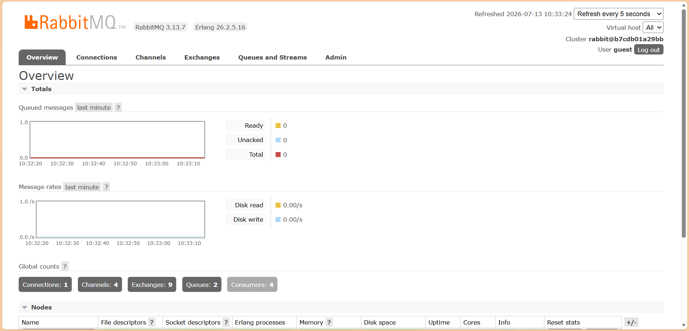

# Invoice Worker Queue - RabbitMQ Work Queue with Spring Boot

A hands-on demonstration of the **Competing Consumers pattern** using RabbitMQ and Spring Boot 3.
Built as part of a Distributed Systems university assignment and documented as a complete beginner-friendly tutorial.

> 📖 **Full Tutorial Article:** [Read on Medium](#) *(link will be added after publishing)*

> 🔗 **Repository:** [https://github.com/vipusrihar/Invoice_Generation_Queue](https://github.com/vipusrihar/Invoice_Generation_Queue)

---

## What This Project Demonstrates

- How to publish and consume messages with **Spring AMQP + RabbitMQ**
- **Manual acknowledgment** — jobs are never lost even if a worker crashes mid-task
- **Fair Dispatch** with `prefetch=1` — workers get jobs based on capacity, not turn order
- **Dead Letter Queue (DLQ)** — permanently failed jobs are routed away cleanly
- **All failure scenarios** — crash recovery, transient retry, permanent failure, broker-down handling
- A real **REST API layer** (`202 Accepted`) that decouples the client from the background workers

---

## Project Structure

```
Invoice_Generation_Queue/
├── pom.xml
└── src/main/
    ├── java/com/invoicequeue/
    │   ├── InvoiceQueueApplication.java     ← Spring Boot entry point
    │   ├── config/
    │   │   └── RabbitMQConfig.java          ← Queue, Exchange, DLQ, JSON converter
    │   ├── model/
    │   │   ├── InvoiceRequest.java          ← Message payload (serialised to JSON)
    │   │   └── InvoiceResponse.java         ← REST API response model
    │   ├── producer/
    │   │   ├── InvoiceController.java       ← REST endpoints
    │   │   └── InvoiceProducer.java         ← Publishes jobs to RabbitMQ
    │   └── consumer/
    │       ├── InvoiceWorker.java           ← Main worker — handles all outcomes
    │       └── DeadLetterWorker.java        ← Logs permanently failed jobs from DLQ
    └── resources/
        └── application.properties          ← All RabbitMQ config in one place
```

---

## Tech Stack

| Technology | Version | Purpose |
|---|---|---|
| Java | 21 | Language |
| Spring Boot | 3.2.5 | Application framework |
| Spring AMQP | (via Boot) | RabbitMQ integration |
| RabbitMQ | 3.x | Message broker |
| Docker | 24.x+ | Running RabbitMQ locally |
| Lombok | latest | Reduces boilerplate |
| Maven | 3.x | Build tool |

---

## Getting Started

### Prerequisites

```bash
java -version    # must show openjdk 21
mvn -version     # must show Apache Maven 3.x.x
docker -version  # must show Docker version 24.x or later
```

> 💡 If you're using IntelliJ, running `mvn install` manually is not mandatory - IntelliJ will build the project for you.

### Step 1 — Clone the Repository

```bash
git clone https://github.com/vipusrihar/Invoice_Generation_Queue.git
cd Invoice_Generation_Queue
```

### Step 2 — Start RabbitMQ with Docker

```bash
docker run -d --name rabbitmq -p 5672:5672 -p 15672:15672 rabbitmq:3-management
```

Verify it is running:

```bash
docker ps
# rabbitmq container should show status "Up"
```

Open the Management UI: `http://localhost:15672` - Username: `guest` / Password: `guest`

<!-- IMAGE: RabbitMQ Management UI login/overview screen -->


### Step 3 — Build the Project

```bash
mvn clean install
# Expected: [INFO] BUILD SUCCESS
```

> **If BUILD FAILURE:** confirm `java -version` shows 21, and check all files are in the correct folders.

### Step 4 — Run the Application

```bash
mvn spring-boot:run
```

Look for this banner in the startup logs:

```
╔══════════════════════════════════════════════════════════════╗
║         Invoice Worker Queue — Application Started           ║
╠══════════════════════════════════════════════════════════════╣
║  REST API       →  http://localhost:8080/api/invoices        ║
║  Health Check   →  http://localhost:8080/actuator/health     ║
║  RabbitMQ UI    →  http://localhost:15672  (guest/guest)     ║
╚══════════════════════════════════════════════════════════════╝
```

<!-- IMAGE: terminal screenshot showing the startup banner above -->


If you see `Connection refused` — RabbitMQ is not running. Go back to Step 2.

### Step 5 — Confirm the Connection

```bash
curl http://localhost:8080/api/invoices/health
# Expected: { "status": "UP" }

curl http://localhost:8080/actuator/health
# Look for: "rabbit": { "status": "UP" }
```

**Postman equivalent:**

| Field | Value |
|---|---|
| Method | `GET` |
| URL 1 | `http://localhost:8080/api/invoices/health` |
| URL 2 | `http://localhost:8080/actuator/health` |

<!-- IMAGE: side-by-side or stacked screenshot of both Postman responses above -->



Also check `http://localhost:15672` → **Queues tab**. You should see both queues created automatically:
- `invoice_generation_queue`
- `invoice_dead_letter_queue`

<!-- IMAGE: RabbitMQ Queues tab showing both queues -->


---

## Testing All Scenarios

Open a second terminal. Keep the app running in the first.

> 💡 **Using Postman instead of cmd?** `curl` with multi-line JSON often breaks in Windows Command Prompt due to quoting rules. Every scenario below includes a ready-to-use Postman setup — just set the method, URL, headers, and paste the body in the "raw / JSON" tab.

---

### ✅ Scenario 1 — Happy Path

```bash
curl -X POST http://localhost:8080/api/invoices/submit \
  -H "Content-Type: application/json" \
  -d '{
    "invoiceId": "INV-TEST-001",
    "customerName": "Vipu Dev Solutions",
    "customerEmail": "vipu@example.com",
    "invoiceType": "ITEMIZED_WITH_TAX",
    "complexityDots": "...",
    "totalAmount": 5500.00,
    "currency": "USD"
  }'
```

**Postman equivalent:**

| Field | Value |
|---|---|
| Method | `POST` |
| URL | `http://localhost:8080/api/invoices/submit` |
| Headers | `Content-Type: application/json` |
| Body (raw → JSON) | *(same JSON object as above)* |

Expected response (~5ms):
```json
{
  "invoiceId": "INV-TEST-001",
  "status": "ACCEPTED",
  "message": "Invoice job queued. A worker will process it shortly.",
  "estimatedProcessingTime": "3 second(s)"
}
```

Watch Terminal 1 — the worker picks up the job and renders second by second.

---

### ⚖️ Scenario 2 — Fair Dispatch (Batch of 5 Jobs)

```bash
curl -X POST http://localhost:8080/api/invoices/submit-batch
```

**Postman equivalent:** `POST` request to `http://localhost:8080/api/invoices/submit-batch` — no headers or body needed.

Queues 5 jobs with complexities: 1s, 3s, 1s, 5s, 2s.
Watch both worker threads share jobs based on capacity in the logs.

---

### 💀 Scenario 3 — Worker Crash Mid-Job

```bash
# Step 1: Submit a 5-second job
curl -X POST http://localhost:8080/api/invoices/submit \
  -H "Content-Type: application/json" \
  -d '{
    "invoiceId": "INV-CRASH-TEST",
    "customerName": "CrashTest Corp",
    "customerEmail": "crash@test.com",
    "invoiceType": "ANNUAL_REPORT_INVOICE",
    "complexityDots": ".....",
    "totalAmount": 99999.00,
    "currency": "USD"
  }'

# Step 2: Wait until you see "2/5 sec" in the logs, then press Ctrl+C to kill the app

# Step 3: Open http://localhost:15672 → Queues → see Ready: 1  (auto re-queued!)

# Step 4: Restart
mvn spring-boot:run
# The same job re-delivers and completes automatically — zero data loss
```

**Postman equivalent for Step 1:** `POST` to `http://localhost:8080/api/invoices/submit`, header `Content-Type: application/json`, body = the same JSON object.

---

### ❌ Scenario 4 — Permanent Failure → Dead Letter Queue

```bash
curl -X POST http://localhost:8080/api/invoices/submit \
  -H "Content-Type: application/json" \
  -d '{
    "invoiceId": "INV-FAIL-BAD-DATA",
    "customerName": "BadData Ltd",
    "customerEmail": "bad@data.com",
    "invoiceType": "SIMPLE_RECEIPT",
    "complexityDots": ".",
    "totalAmount": 0,
    "currency": "USD"
  }'
```

**Postman equivalent:** `POST` to `http://localhost:8080/api/invoices/submit`, header `Content-Type: application/json`, body = the same JSON object.

Invoice ID containing `FAIL` → `basicNack(requeue=false)` → routes to `invoice_dead_letter_queue`.
Check `http://localhost:15672` → Queues to confirm.

---

### ⚠️ Scenario 5 — Transient Failure with Retry

```bash
curl -X POST http://localhost:8080/api/invoices/submit \
  -H "Content-Type: application/json" \
  -d '{
    "invoiceId": "INV-RETRY-TEST",
    "customerName": "Flaky Services Inc",
    "customerEmail": "retry@flaky.com",
    "invoiceType": "STANDARD_INVOICE",
    "complexityDots": "..",
    "totalAmount": 1200.00,
    "currency": "USD"
  }'
```

**Postman equivalent:** `POST` to `http://localhost:8080/api/invoices/submit`, header `Content-Type: application/json`, body = the same JSON object.

Invoice ID containing `RETRY` → fails 3 times → `basicNack(requeue=true)` → succeeds on attempt 4.

---

### 🔌 Scenario 6 — Broker Down

```bash
docker stop rabbitmq

curl -X POST http://localhost:8080/api/invoices/submit \
  -H "Content-Type: application/json" \
  -d '{"invoiceId":"INV-NO-BROKER","customerName":"Test","customerEmail":"t@t.com","invoiceType":"SIMPLE_RECEIPT","complexityDots":".","totalAmount":100,"currency":"USD"}'

# Expected: HTTP 503 Service Unavailable
# { "status": "FAILED", "reason": "Message broker is currently unavailable." }

docker start rabbitmq
```

**Postman equivalent:** stop the RabbitMQ container first, then `POST` to `http://localhost:8080/api/invoices/submit` with header `Content-Type: application/json` and the same (single-line) JSON body.

---

### 🚫 Scenario 7 — Missing Required Fields

```bash
curl -X POST http://localhost:8080/api/invoices/submit \
  -H "Content-Type: application/json" \
  -d '{ "customerName": "Incomplete Corp" }'

# Expected: HTTP 400 Bad Request
# { "status": "REJECTED", "reason": "invoiceId is required and cannot be blank" }
```

**Postman equivalent:** `POST` to `http://localhost:8080/api/invoices/submit`, header `Content-Type: application/json`, body `{ "customerName": "Incomplete Corp" }`.

---

## Scenario Summary

| Test | Trigger | Expected Outcome |
|---|---|---|
| Happy Path | `POST /submit` valid data | `202` in ~5ms, worker renders in background |
| Fair Dispatch | `POST /submit-batch` | Two workers share jobs by capacity |
| Worker Crash | `Ctrl+C` mid-render, restart | Job re-queued, completed after restart |
| Permanent Failure | `invoiceId` contains `FAIL` | Routes to Dead Letter Queue, no retry |
| Transient Failure | `invoiceId` contains `RETRY` | Re-queued up to 3x, then succeeds |
| Broker Down | `docker stop rabbitmq` + submit | `503` returned, job not silently lost |
| Bad Request | POST with missing `invoiceId` | `400` returned, never reaches queue |

---

## Monitoring

Open `http://localhost:15672` → **Queues tab** → click `invoice_generation_queue`.

| State | Meaning |
|---|---|
| **Ready: N** | N jobs waiting for a worker |
| **Unacknowledged: N** | N jobs actively being processed right now |
| **Ready: 0, Unack: 0** | Queue empty — all jobs done |
| **DLQ has messages** | Permanently failed jobs — needs investigation |

During Scenario 3 (crash test): watch `Unacknowledged` drop to 0 and `Ready` go up to 1 — that is the re-queue happening live.

---

## Useful Commands

```bash
docker ps                          # check RabbitMQ is running
docker logs rabbitmq               # view RabbitMQ internal logs
docker stop rabbitmq               # stop broker (broker-down test)
docker start rabbitmq              # start broker again
docker rm -f rabbitmq              # full reset — clears ALL queues and messages
docker run -d --name rabbitmq -p 5672:5672 -p 15672:15672 rabbitmq:3-management            
                                  # fresh start after reset

# Run a second worker on a different port (competing consumers)
mvn spring-boot:run -Dspring-boot.run.arguments="--server.port=8081"
```

---

## Key Concepts at a Glance

| Concept | What It Does                                                             |
|---|--------------------------------------------------------------------------|
| `basicAck` | Tells RabbitMQ the job is done - always placed *after* the work          |
| `basicNack(requeue=true)` | Temporary failure - re-queues the message for retry                      |
| `basicNack(requeue=false)` | Permanent failure - routes to Dead Letter Queue                          |
| `prefetch=1` | Fair Dispatch - one job at a time per worker, based on capacity          |
| `durable=true` | Queue survives broker restarts - messages written to disk                |
| `202 Accepted` | Correct HTTP status for async - "received, processing in background"     |
| Dead Letter Queue | Safety net for unrecoverable failures - visible, inspectable, replayable |

---

## 📖 Read the Full Tutorial

The complete article explaining every concept, analogy, and decision:

👉 **[Read on Medium](#)** *(link will be updated after publishing)*

---

*Built for learning. Broken intentionally. Recovered automatically.*